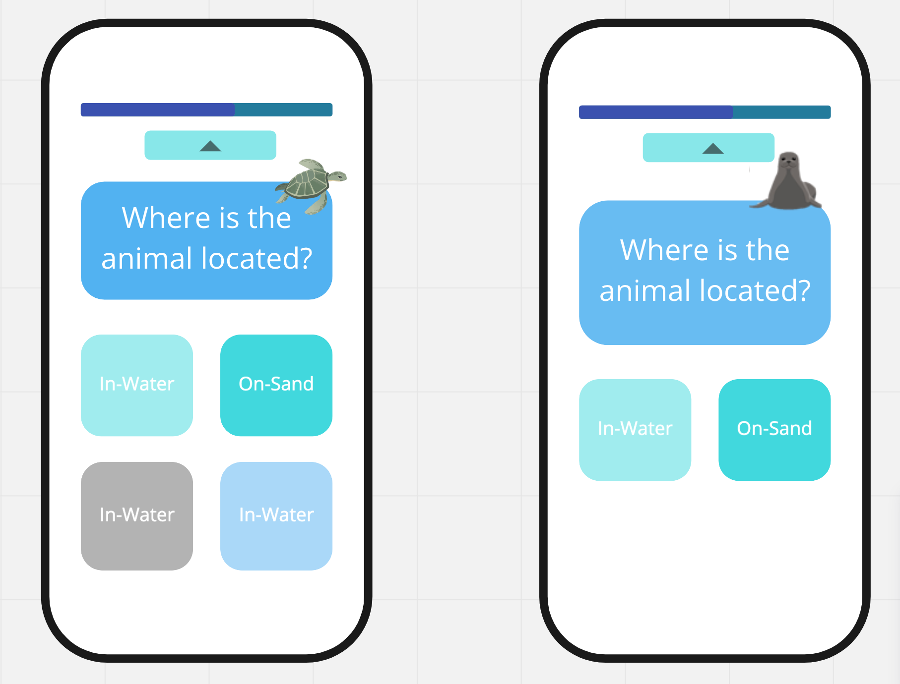

## “Hi Professor, I have 10 questions if that’s okay?”
Questions and I go way back. Okay not that back because I’m only 20 years old, but asking questions has really become second nature for me. It wasn’t always like that though; when I was younger, I’d always be afraid to ask for help due to shyness or embarrassment. Thankfully, the middle school/high school I went to had a very small amount of students per grade level. In my class, we had a little less than 50 students. Because I got to know basically everyone in my class, I always felt like I was in a supportive, learning environment. Fast forward to today, while I can confidently ask questions (and believe me I do), the question now is: which questions *should* I ask and how can they be refined to maximize what I learn from the response?
## Questions as a CS student
Specifically, as a computer science student, being able to find answers when you’re in the middle of coding is really a fine art. For example, in my current internship at the Department of Taxation, I was tasked to convert a folder of xml schemas that are hierarchically organized into one schema. When I first started this task, it felt daunting because I had to learn what XML (and XML schemas) are and learn how to manipulate it in Visual Studio using C# (an IDE and programming language I’ve never used). During this time, a lot of research was done to get started on my task and also during this time, a lot of mistakes were made. Namely, I used search terms that weren’t the most accurate and I should have spent more time reading the documentation in order to better formulate my questions. 
### A quick interlude of XML schemas

In case you ever have to do this task, here’s a brief description of it. First of all, in order to create this one result file (called the flattened file–I made the mistake of not researching using this term), you need to first find the root file. This root file essentially is the heart of the flattened file and calls for other components to build itself up. Or to put it another way, the flattened file is a template for a hamburger. However, each component of the hamburger (buns, lettuce, tomato, etc) have components of their own. So currently at my internship, I’ve been using recursion to start from the root file and gather all of the components from their proper files.
## Examination of questions on Stack Overflow
 
As many programmers will attest, Stack Overflow can really be your lifesaver. It’s amazing how a community of askers and answerers creates an environment that helps people learn from other people’s struggles. However, the amount of time knowledgeable people can dedicate to answering questions is extremely limited so through the torrent of questions asked on Stack Overflow, they have to weed out the questions they don’t think are worth answering. As Eric Steven Raymond says in his [article](http://www.catb.org/esr/faqs/smart-questions.html) about smart questions, “We [answerers] take time out of busy lives to answer questions, and at times we're overwhelmed with them. So we filter ruthlessly.”
### Regex
Below are two questions from Stack Overflow, demonstrating a smart and not so smart question. Both involve Regex (**Reg**ular **Ex**pression), which is essentially like a language itself that can help you form a “net” that only captures certain characters. It looks a little wonky (e.g. `/^[a-zA-Z]{2,5}$/`), but with practice, it can be a very powerful tool.
### A not so smart question
[Here](https://stackoverflow.com/questions/44418349/regular-expression-for-accepting-only-alphabets-and-within-2-to-5-char-length?noredirect=1&lq=1), user Tamil.S asks a question to get a RegEx for accepting only characters in the alphabet and has between 2 to 5 characters. However, Tamil.S only specifies what they want in their title: “Regular expression for accepting only alphabets and within 2 to 5 char length” and never restated the question again within the post itself. Instead, their post just looks like this:

> Accept:
> - `text`
> - `Text`

> Don't accept:
>  - `text1`
>  - `text@`
>  - `123@#`
>  - `Te12$`
 
While test cases are helpful, this forces answerers to look at the title which can be annoying. However, what’s really bad about this question is that Tamil.S doesn’t demonstrate whether they’ve attempted to solve this problem and what worked or didn’t work. This makes people less inclined to answer because they for one, don’t know which part you’re exactly stuck at and for another, makes the asker appear lazy and not serious about the question. Luckily, kindhearted user Michał Perłakowski tried to answer Tamil.S’s question. We can tell that Michal is a seasoned answerer because not only did he give an answer, but he also created an embedded code snippet that allows Tamil.S to see the code in action. However, if we look closer at Tamil.S’s replies to Michal’s answer, I definitely feel like Tamil could’ve been nicer and more thankful. Specifically, Tamil.S gives replies that aren’t very helpful (e.g. “I want my input string allow only alphabets and accept 2 to 5 char length.”) and in the end, even though Michal asked for Tamil.S.’s entire code, he didn’t. This is problematic because one advice Raymond has is to “provide a way to *reproduce the problem in a controlled environment*.” to make it easier for answerers to help. What happened in the end? Michal stopped responding and probably determined that trying to answer this question wasn’t worth his time anymore. Lastly, this question has actually been answered on Stack Overflow before. Therefore, Tamil.S. didn’t even try to solve this problem on their own before just firing off the question into Stack Overflow. 

###  A smart question
[Here’s](https://stackoverflow.com/questions/1649435/regular-expression-to-limit-number-of-characters-to-10?noredirect=1&lq=1) the Stack Overflow question that could’ve helped user Tamil.S figure out his problem. User fiktionvt essentially had the same question which was to “allow lowercase letters and up to 10 characters” using Regex. However, because of the way he wrote his question (aka in a smart way), he was able to get a lot of people’s help. In fact, this question has been viewed 555k times. 
For one, fiktionvt restated the question which makes it clear what exactly they are looking for. Next, fiktionvt demonstrated that they actually attempted to solve this problem by providing a Regex that they’re working on and a prior iteration that was almost successful. Additionally, the code was formatted which makes it easier for people to understand the question. Naturally, many responses were made and many of these responses were also very educational. For example, user cletus provided an answer (shown below) that went further than just answering fiktionvt’s question; cletus also outlined what different options there are with Regex.
```
 - {3} Exactly 3 occurrences
 - {6,} At least 6 occurrences
 - {2,5} 2 to 5 occurrences
```

## Question your questions
At the end of the day, it can be easy to talk about what makes a smart question, but actually formulating one is much harder. For questions related to coding in particular, I think one important thing to keep in mind as one is working is to not do things last minute and to keep track of what has worked or failed (in case you need to ask a question later on). Reading Eric Steven Raymond’s essay about smart questions has made me realize that the people who are answering your questions (e.g. on Stack Overflow) are really just volunteering their time to answer your questions and may appear impatient, but it’s because they really want you to learn and only ask questions that can be beneficial to many people. 

  To me, questions help you bridge and solidify your knowledge, so improving this skill can help you learn more effectively. 
*Sidenote: if you didn’t get the joke in the title, try saying “Chen’s Quest” with “Quest” first.*
