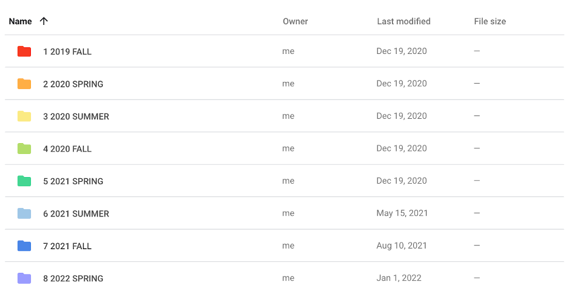
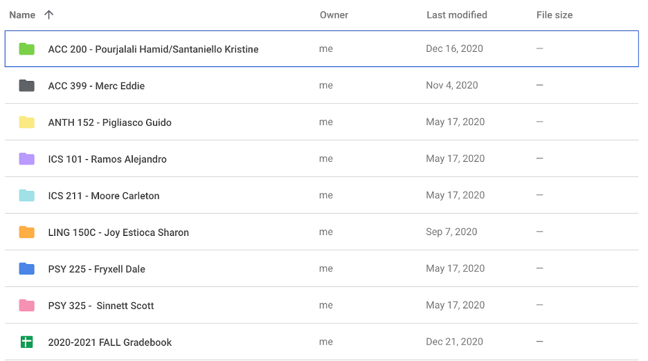

## Ask me about my calendar
Have you ever looked at a piece of code and just thought it’s gorgeous from a purely aesthetic view? The indentations are in the correct places, the comments break up the code nicely, and the length of the lines are just perfect. Well, when I first started coding in ICS 111 (Introduction to Intro to Computer Science I), one thing that I really loved doing was making the code look “pretty”. I thoroughly enjoyed organizing the code to not only be logically structured but also aesthetically pleasing. In fact, I’m kind of an organization fanatic when it comes to digital things. As you can see in the photos below of my Google Drive, organizing, especially with colors, is my jam. So coding provides me with another medium to fiddle my organization techniques with.
--

--

## Codifying how to code
As I’ve taken more coding classes, more rules about how to format the code emerged (or as I learned–they’re called coding standards). Before learning more about it, I thought coding standards were mainly about aesthetics or nitpicky specifications like how many new lines can come after a curly brace. Then we started using [ESLint](https://eslint.org/) which is a linter (what a cute/strange name, huh? I just imagine my code is like a shirt and any snafus the linter detects are lint) for maintaining coding standards in our JavaScript code. Apparently, basically every language has its own linter that’s designed to best suit that language. In the last 5 or so times I’ve experienced ESLint, it’s been pretty snazzy. To me, it’s kind of like having a coding buddy (albeit a very straight talking one). 

Best of all, I never realized that coding standards can also include best coding practices. For example, through ESLint, I’ve finally realized when to use “const” or “let” to declare variables. The keyword “const” is essentially like buying a house while “let” is like renting a place. We would expect residents of a bought house to be more or less permanent, whereas renters come and go. Although this analogy breaks a little for arrays because of pointers. I’m pretty sure an array can be declared as a const because the house where the pointer lives is not changing, but the items in the array that the pointer is pointing to can change. In other words, you can declare an array to be a const and can change the array as long as you don’t relocate it. At least that’s my understanding! (if this understanding is completely wrong, please let me know). But that’s another benefit of using ESLint in that it makes you think about things you may not have considered before and really tests your understanding of the language. I didn’t even think a linter could be that smart to actually teach you good practices so I’m thoroughly impressed. I’m actually quite curious about how a linter is created (future project, Alyssia?). 

## Yay or Nay to ESLint
When there are no ESLint errors, a green check mark shows up which is moderately satisfying. What’s actually satisfying is getting rid of the frighteningly large wall of red that ESLint uses to highlight errors. That’s one thing that irks me about IDEs in that it can be hard to focus when things keep popping up (Side note: Red is purposefully used as the color for notifications because of how eye-catching it is…ah so that’s why my social media notifications are red). However, sometimes I just want to code something out and then modify it after I get all my thoughts down. In those cases, I even prefer just writing it all out on paper.

At the end of the day however, linters are powerful tools and help programmers from getting caught up in memorizing coding standards or actually help them understand what the purpose of a particular coding standard is (well, as long as they try to understand why ESLint is proposing a suggestion and not just accepting it). The ultimate goal of coding standards is to create code that not only functionally works, but is also usable by other people now or in the future.

