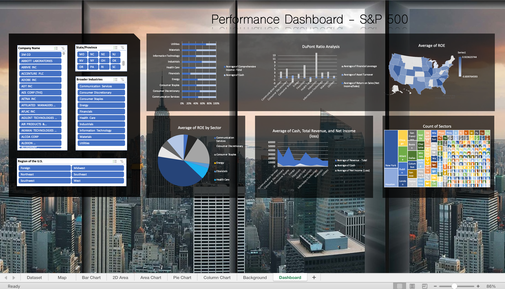

## Description of the application developed
Upon opening the excel workbook, the user will be able to see an interactive dashboard that uses data from S&P 500 companies from 2012-2018. On the right, there are different charts with different accounting measures (e.g. DuPont Ratio analysis, ROE, Revenue, etc). On the left, there are slicers that the user can use to filter the data in order to drill down to more specific visualizations. Through this dashboard, users will be able to dynamically interact with the S&P 500 data.

## Pictures

## What I personally contributed to the project
For this project, I worked with another person in the class (ACC 399 - Data Analytics) who is an Accounting PhD student. She found the data and made preliminary charts. Additionally, at the time I had no accounting experience, so she taught me how to calculate certain measures. I put things together by coding the data (dividing it into industries), creating more charts, and building the dashboard.

## What I learned from the experience
For this experience, I learned about slicers and how to connect the charts to the slicers so that they all dynamically update. Another thing I learned was that it's okay to not be an expert in the subject matter (I hadn't taken an accounting class yet) because you can ask for assistance from your team members. Additionally, I also learned about the limitations of using excel. Namely, because it's no designed to be a database that's constantly updated, it can be hard to feed additionally data to the dashboard without manually changing some things.
