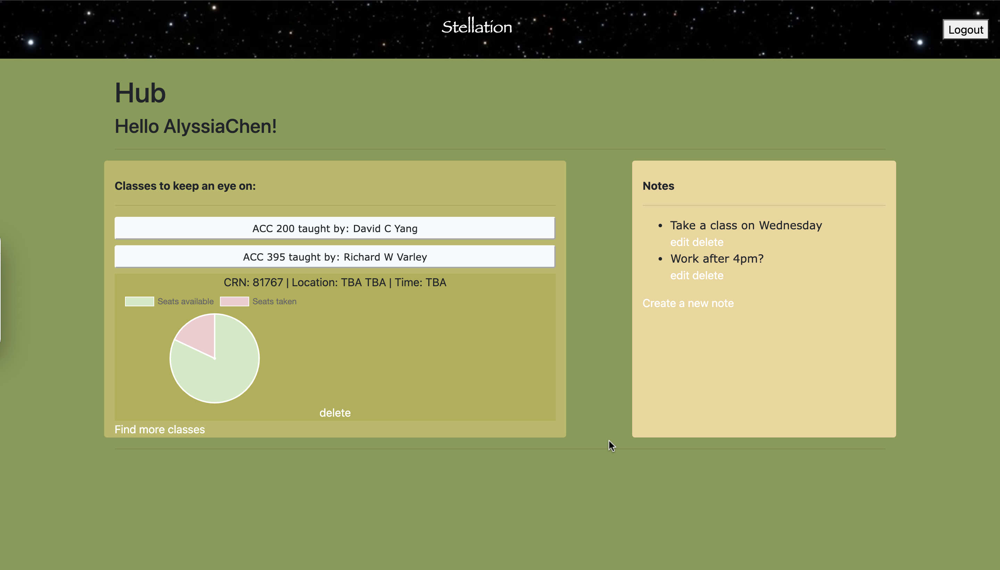

## Description of the application developed
As university students, the registrations period for classes can be quite hectic. You never know if you're going to get the class you want and available seats dwindle very quickly. The University of Hawaii at Manoa provides a [website](https://www.sis.hawaii.edu/uhdad/avail.classes?i=MAN) that allows people to browse classes more easily, but is divided by department which can make it tedious. Alternatively, students can use a website called STAR to search and filter classes, but sometimes it takes awhile to for the results to appear. Recognizing these problems, my [teammate](https://mujtaba-a-quadri.github.io/) and I decided to build a web application that allows students to search through classes and save ones they're interested in "keeping an eye on" (aka on their hub page) before the registration period ends.

## Pictures

## Links to the source code (and deployed application)
 - [Source code](https://github.com/alyssia-chen/Toothless)
 - [Deployment](https://stellation.herokuapp.com/)

## What I personally contributed to the project

After we developed the project idea, we came up with the pages we needed and how they would be connected. One of the main things we had to do was get the data for the application. In this case, we scraped the class availability website (see image for example of what a typical page looked like). I did some tutorials on how to do web scraping and came with the first draft of our scraping code. Once I designed a general layout of how the pages would look, I worked on the hub page while Abdullah worked on the page that allows users to search and add classes. 

## What I learned from the experience
This was my very first experience with any web development (and with git and python) and in the beginning I was very nervous that I wouldn't be able to learn how to do all this within a month. However, I found that practicing constantly (repeatedly completing tutorials) helped me pick up on the concepts relatively quickly. Besides learning how to scrape websites and how to use the Django framework, I also experienced my first team coding project. As we progressed the project, I learned the value of having teammates when I could discuss any ideas I had and easily handoff parts I was struggling with. Lastly, through this project I discovered my love for working on coding projects. No matter how busy or tired I was, as soon as I started working on this project, I would be able to work for hours on end. 
