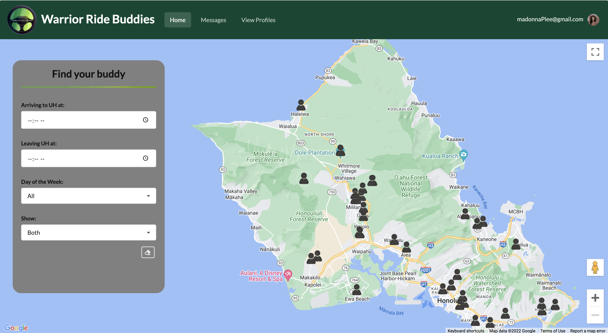
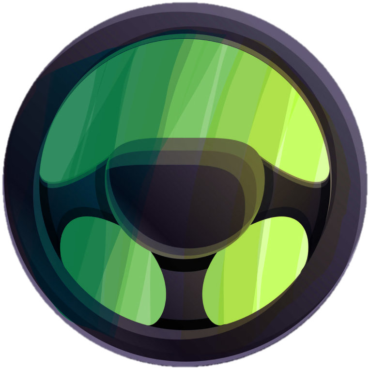

## Overview of the project
Warrior Ride Buddies is an application to help University of Hawaii at Manoa students get to and from campus through the use of carpools. Because of Hawaii's heavy traffic and because of how hard/expensive parking is, carpooling is a very viable option. Once in the application, users can easily find other users that live in their area by utilizing the map feature and filtering by time and driver/rider. After finding a suitable carpool opportunity, our application also allows users to directly message people through the app to arrange carpools.

## My contributions

The first two things I worked on was the landing page and the main page layout. It was fun to finally create pages in Meteor that weren’t just for practice, and to get feedback on it from my teammates. The most interesting part to figure out were the filters though. One struggle I ran into was that some filters had different ways they activated “events.” In other words, I had to make a different function for filters that reported that they were changed. However, I did find that as long as I provided a string that represented which filter was changed, I could easily use one function to handle the changes in the data. Lastly, I worked on the form for creating and editing trips (aka what day and when you’ll leave or arrive in UH) and the uploading of images into the collection (using uploadcare).

For this project, I took on a bit of a management role, but compared to other group projects I’ve done before, I tried to be less hands-on, because I wanted to follow more Agile practices. For example, when creating issues, I tried not to specify the exact details of the issues and limit people’s creativity and freedom. Besides managing the project board, I also tried to create agendas for our meetings and in general, check in with people so that we stay on the same page.

On the more aesthetic side of things, I created the logo of our application. I had initially wanted to go for a more warrior-looking logo, but when I attempted to draw a warrior, it did not turn out great (my drawing looked like a bird). However, when I was fiddling with a different design (steering wheel), I realized that the cape I drew for the warrior (green streaks) could bring a good pop of color, so that’s how the current logo was born! Website-wise, I added the green bar accents throughout the application to introduce some color to our pages and to balance out the gray.

## What I learned
What I loved learning about the most was finally understanding React. If you’ve read my musings on some past projects I did (hackathons), I mainly focused on the databases and expressed my desire to figure out React, but never really got a chance to. So, now I feel a lot more confident in my React capabilities. It could definitely use some more practice, but I finally understand props (kinda like the food a component needs to get going) and state (the current snapshot of certain parts of the component). I also learned how to do some testing which I found that the process wasn’t as exciting as I thought it’d be, but I definitely see its value. Our group struggled with testing though because running them often took more than 10 minutes due to our use of the google maps api which made it very excruciating. In that sense, I can see how real-time and immediate testing can help with making better code. Finally, I also learned that being able to show your work in group meetings can be valuable because it allows people to get a sense of pride and to also get immediate feedback.

## Links
- [Source code](https://github.com/warrior-ride-buddies/warrior-ride-buddies)
- [Deployment](https://warriorridebuddies.ddns.net/)
- [More details](https://devpost.com/software/daaj)