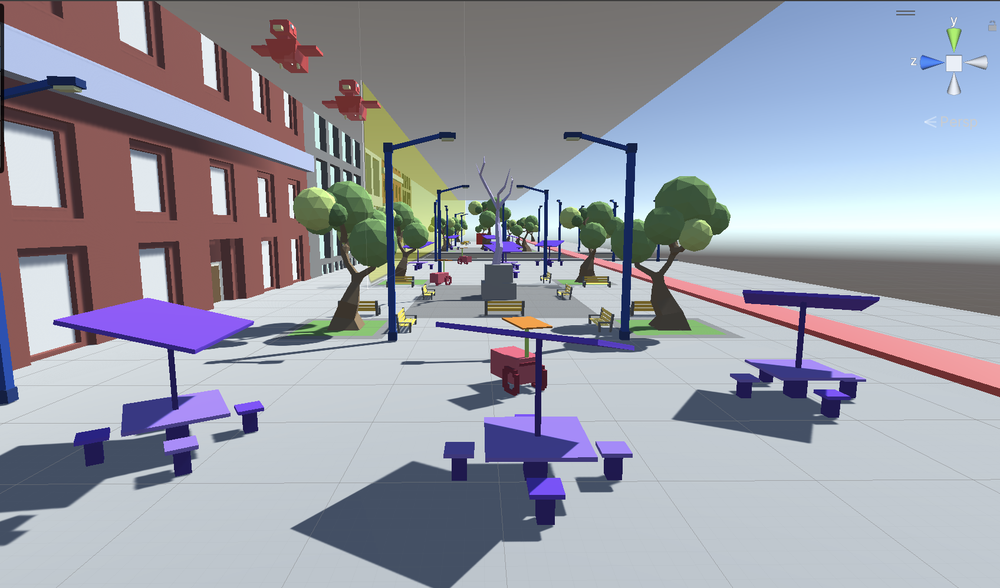

# Overview of the project
City Traversal is a game that challenges the player to use a crane to transport a fragile statue through a very breakable city-scape environment and land the statue on its designated platform. Challengers will experience an opportunity to test their patience and courage as they maneuver through the environment.

My two teammates and I created this game using Unity and Blender for our final game design project.

# Links
 - [Deployment](https://chakhon.itch.io/city-traversal)
 - [More details (website created by the team)](https://sites.google.com/hawaii.edu/city-traversal)

# My contributions
For our demo, the first thing I worked on was creating the destructible item class. This class essentially made things fall apart once they were hit with enough force. Next, I worked on the preliminary UI system which allowed the user to see themselves timed and to gain/lose points. Additionally, before the demo, I created a tree in Blender and worked on the sound design with my brother. Since we had a variety of objects, we needed quite an assortment of sounds. Lastly, I created the mechanism to detect when the player has landed the statue on its designated platform.

After feedback from our classmates and professor on our demo, I worked on cleaning up the UI and adding a receipt (shows how much damage was done by the player). Additionally, I created some "citizens" to roam the city and animated some of our other assets.

# What I learned
One of the first things I learned when we started working on our final game project was being able to drop an idea despite the work put into it. Before we worked on this game, we had actually dedicated quite a bit of time to making a different game, but due to time and ability constraints (along with our professor’s feedback), we decided to come up with a new game idea.

Another thing I learned was that what I coded had to take into account what the artist needs. Specifically, one issue we ran into was that the artist on our team would shrink and modify assets on the map, but my destructible class didn’t account for this so we would run into giant trees falling apart on the map. Thankfully, it was an easy fix, but it definitely made me more aware about what my code should consider. 
