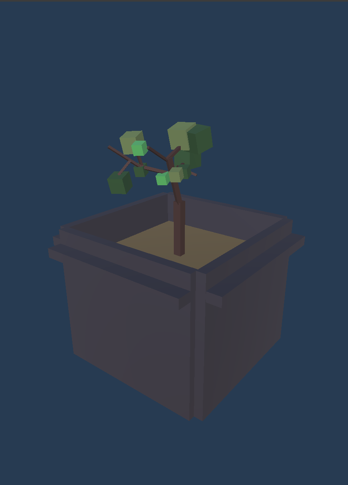
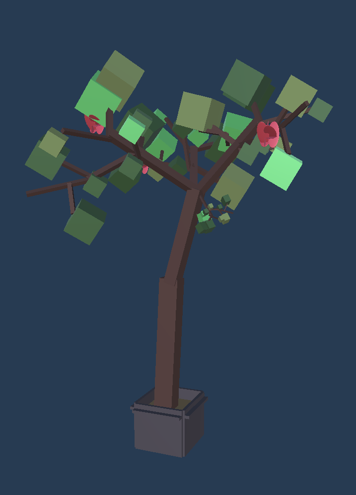

# Overview of the project

What happens when an artist sculpts a clay baby with the heart of a pomegranate seed? As you progress through the game, scenes of this story are revealed. However, each level of the game (timed archery) gets increasingly difficult. Can you figure out what happened to Pomegranate Baby?

Created for my game design class, I made a game (my first game ever!) using Unity.

# Links
 - [Source code](https://github.com/alyssia-chen/Pomegranate-Baby)
 - [Deployment](https://alyssiachen.itch.io/pomegranate-baby) <- Unfortunately, mouse sensitivity got a bit cranked up on itch.io

# My contributions
A few weeks before our solo game project was due, I recalled an old Chinese folk story my told me. It was simple, heartwarming, and I realized that it would be a perfect "hook" for my game. As I thought through the story, details about how I could design the game to help me tell the tale came to me very quickly.

Every weekend, I would hurry to finish the homework for other classes so that I could work on my game project. Specifically, I coded all of the game mechanics in C#, developed the 3D models in Unity, and drew the 2D story panels by hand. During this time, I also fiddled with creating melodies that fit the theme of the music (i.e. innocent, childish, nostalgic, and longing). So if you ever get a chance to hear the theme song, I composed it!

# What I learned
The experience of producing my very own game and having so much fun made me realize that for my future career, I want to do something that allows me to exercise my creativity with visuals. I thoroughly enjoyed being able to bring ideas I had to life with Unity.

I also realized again how working from the basics first (e.g. using cubes to represent different items) can make coding that much easier and also really boosts morale once you replace it with the real items. One week in, everything in my game was cubes, but the second I finally created everything, the whole game felt more lively.

Lastly, I learned about how important it is to have a “hook/pull” in a game. I had only thought the story I was telling was the hook, but my professor also told me that revealing each stage of the plant’s growth also generates interest. It was an angle I hadn't considered and has made me more aware of recognizing the “hooks” of a game.

    
    
    

