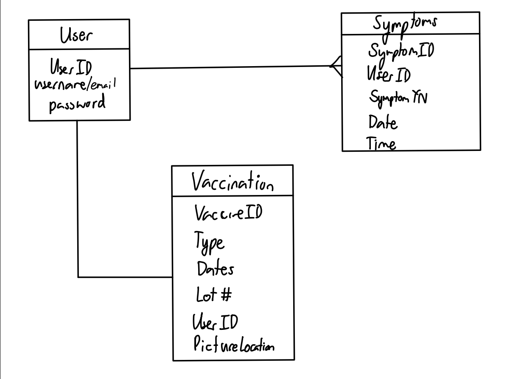

## Description of the application developed
This application allows users to create and maintain an account that allows the user to input and store the user’s past statuses and vaccine information. Once a user signs in, they are directed to a Profile page that allows them to conveniently press a button to add a new status or view statuses. Each status is a record at a certain time of day of the user’s absence or presence of COVID symptoms. Using the navbar, users can go to a webpage that allows them to input information about their vaccine and also upload a picture of their vaccine card (which can be assessed on the View Status page). Essentially, we developed an application that is similar to Lumisight to warm up our Meteor skills.  

## Links to the source code (and deployed application)
- [Source code](https://github.com/ICS491-Fall2021/covid-tracker)
- [Deployed application](https://covid-tracker.meteorapp.com/)
- [More detailed information](https://ics491-fall2021.github.io/covid-tracker.github.io/)

## What I learned from the experience
This was my first time working with Meteor so I learned quite a bit about how to use it and how it differs from other frameworks. Because of my limited experience with creating applications in general, I’m sure I’m not appreciating the profundity of Meteor, but it was definitely interesting to learn about how it works. Specifically, it was amazing to see how the Meteor team took the well-established idea of request-response and replaced it with a new system (a system that involves storing mini databases on the client side and using different protocols and the sub-pub system to maintain database integrity).

Besides the coding experience itself, I also learned more about working on a coding project in larger groups. I only recently did a two-person coding project (my first coding collaboration.. ever) during the summer with a friend, so moving from that to working with a group where I didn’t know half the people was quite an experience. In the past 2 months or so, I've recognized the importance of constant communication within the team and the strength of using better software development practices. 

## What I personally contributed to the project
On the backend side of this project, I created the database for storing statuses (presence or absence of COVID symptoms). My initial drawing for my idea of the database design is shown in the picture on the right. 

Additionally, I also worked on creating the page with the form to add a status. 

On the frontend side, I worked with another team member (Jolie) to design the overall look of the website using Figma. Then I implemented the Profile page to match our design. On the logistical side, I helped with keeping our team on track by creating agendas for our meetings.

I'm excited to work with this team on the upcoming hackathons!

