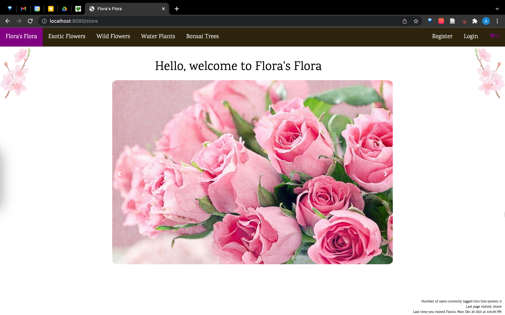
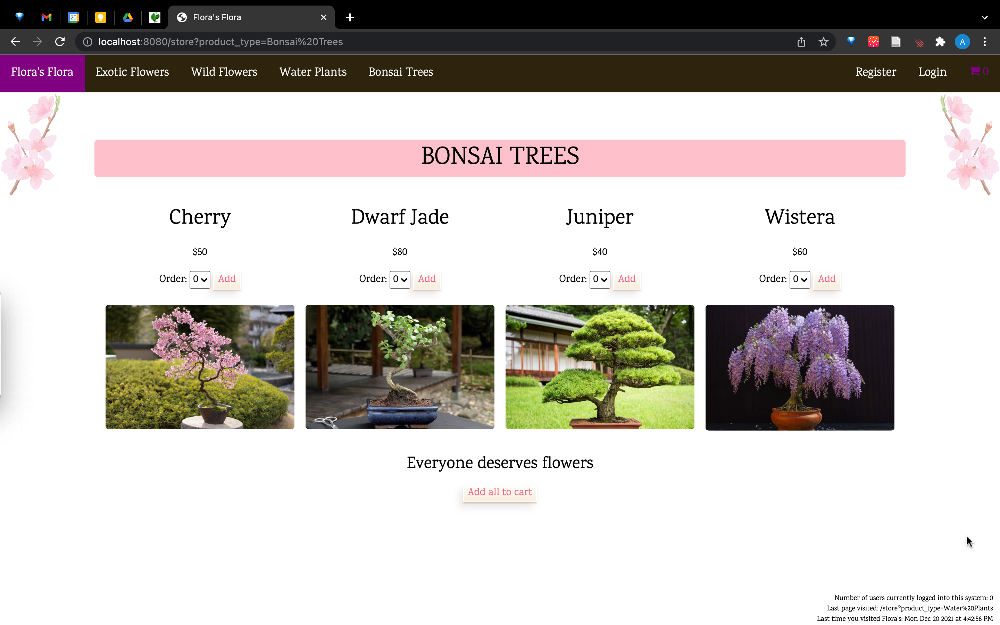
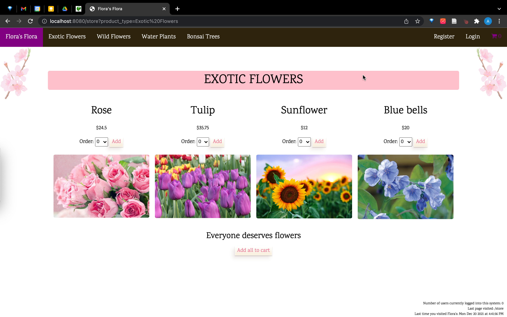
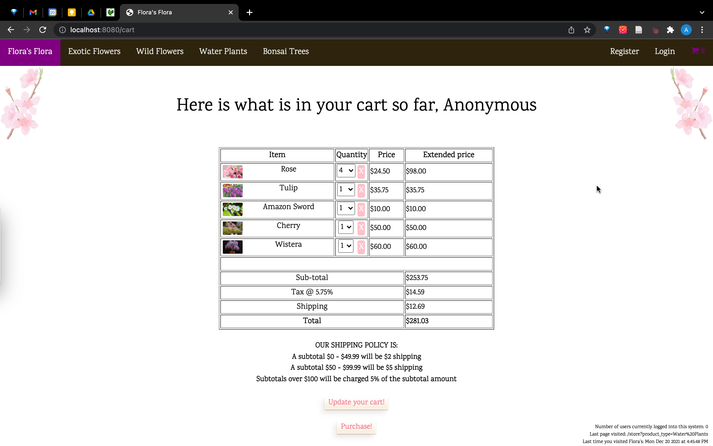
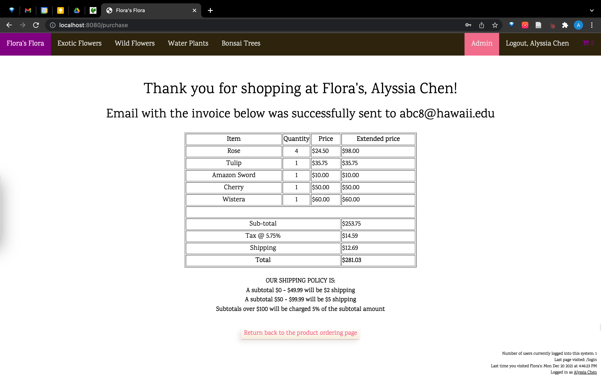
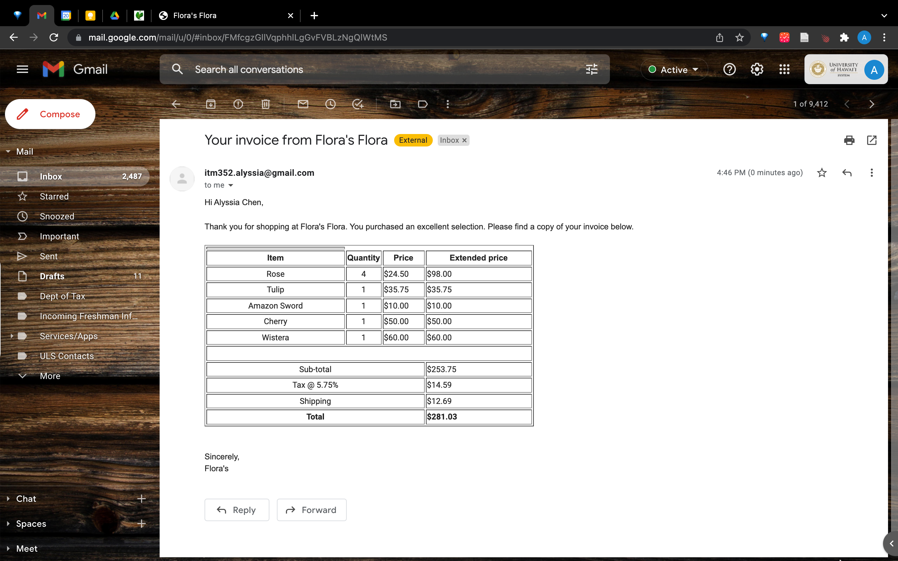
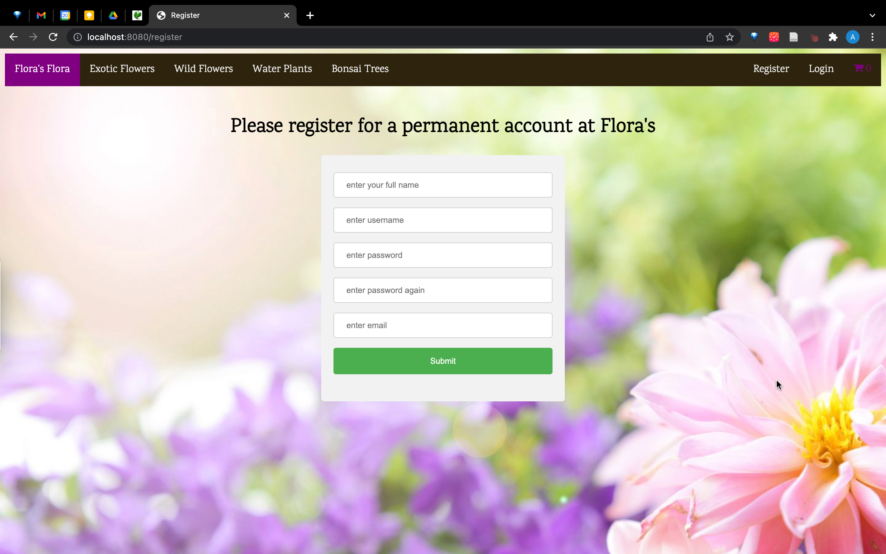
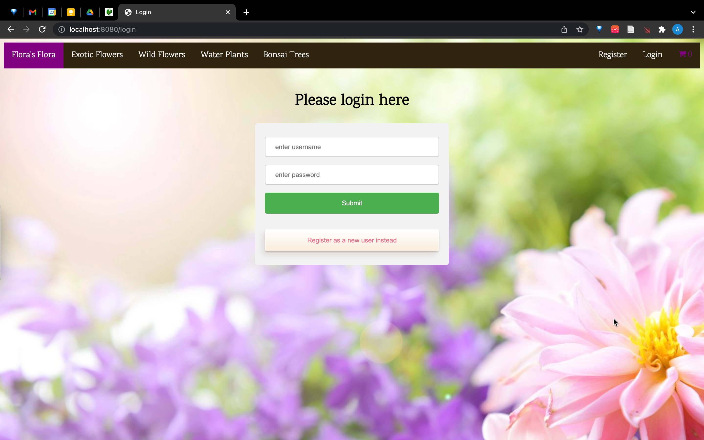
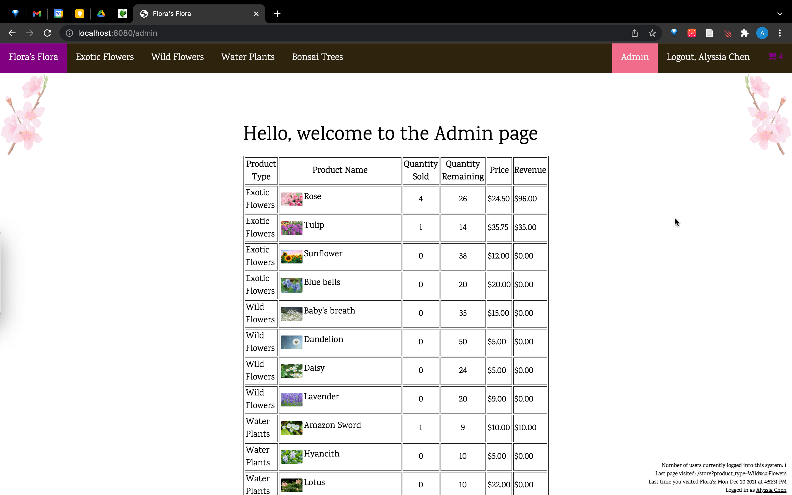

## Description of the application developed
Using what we learned during the course of this class (ITM 352), I built a pretend e-commerce website that sells plants for our final project. The website had to meet a set of requirements. This included a cart that users can edit, an email with the invoice that is sent to the user, and the use of sessions/cookies to maintain personalization.

## Links
 - [Source code](https://github.com/alyssia-chen/ITM352_F21_repo/tree/main/Chen_Alyssia_Assignment3) (Currently private but can be shown upon request)
 - [Brief Video Overview](https://drive.google.com/file/d/1gD3T8P_z3mdMaAVRqeU4ofFGNEvyoIu9/view?usp=sharing)

## What I learned from the experience
My prior experience with building websites was mostly with Meteor so there was definitely a layer of abstraction that I got to unveil with this project. I really enjoyed learning about routing the server requests and it was through this process that I finally understood the difference between GETs and POSTs. Specifically, GET requests are for obtaining data while POST can used for sending data. In this project, whenever the user had to do something to their cart, a POST request was needed. Additionally, I learned how sessions and cookies work and how to use them. I always thought they were some complicated entity, but really they're just strips of data passed between the client and the server. In the future, I hope to learn how to use them as efficiently as possible. Lastly, I learned that my past experience with using meteor and semantic ui can actually come in handy. Namely, I took the good practices that I picked up on to apply to this project such as creating ui components that can be reused throughout the application. 

## Pictures

