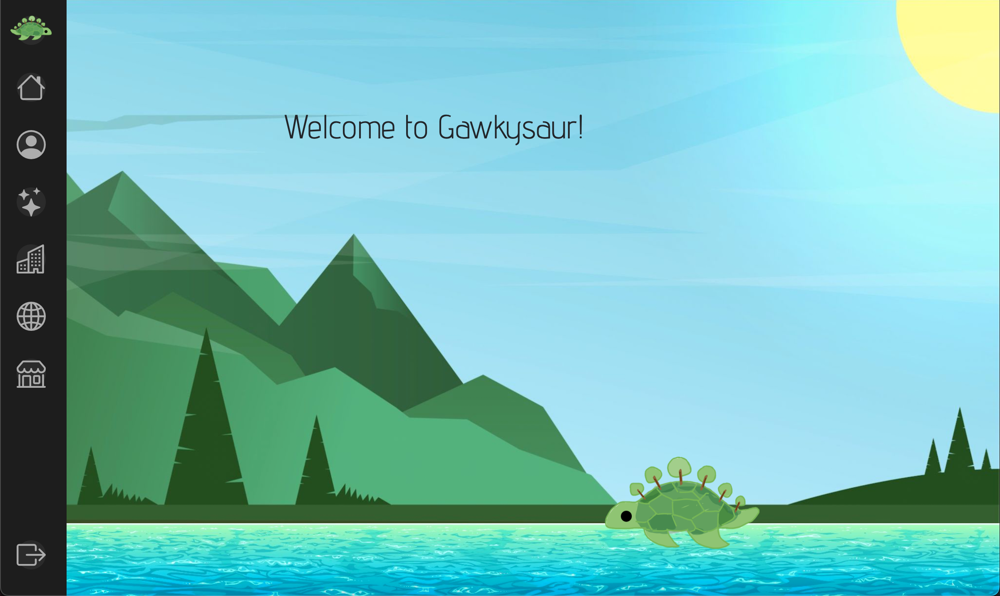

## Description of the application developed

CarbonZero is the application [Kobey Arai](https://kobeyarai.com/), [William Liang](https://william-liang808.github.io/), [Yong-Sung Masuda](https://yongsungm.github.io/), [Gavin Peng](https://devgav.github.io/) and I designed, implemented, and deployed in 1 week (September 23 to September 30) for the Meteor Hackathon. Our idea was to create a gamified app that allows users to track their habits while utilizing theories of social comparison to promote and maintain action.

More details can be found here: [CarbonZero README page](https://github.com/sus-gawky/sus-gawky/blob/main/README.md).

Here's an [article](https://blog.meteor.com/team-sus-gawky-earns-2nd-place-in-the-2022-meteor-hackathon-2be8ab67bb15) that the Meteor Team wrote about our application as it won 2nd place for the 2022 Meteor Hackathon.

## Links to the source code (and deployed application)
 - [Source code](https://github.com/sus-gawky/sus-gawky)
 - [Deployment](https://sus-gawky.meteorapp.com/)
