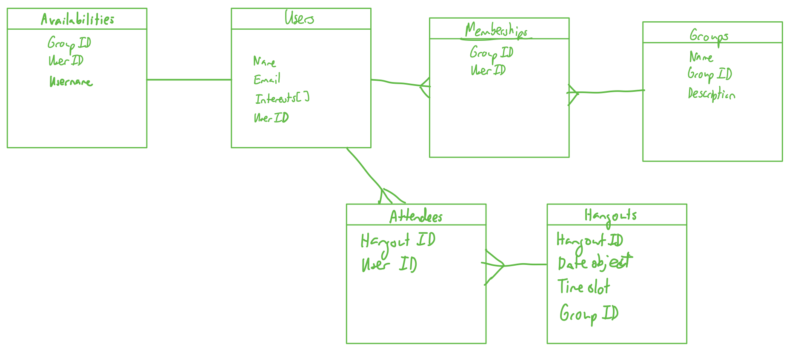

# Proxamie
## Description of the application developed
Proxamie is the application [Jolie](https://jolieching.github.io/), [Dylan](https://dylandecker.github.io/projects/), [Abdullah](https://mujtaba-a-quadri.github.io/), and I designed and completed in 5 days for the Meteor Hackathon. Our idea was to create an application where people could schedule “hangouts” in self-created groups based on everyone’s availability and interests, but in a more responsible and safer way by implementing safety features such as a warning when hangout groups are greater than a certain size and tracking who the user has been in contact with (hung out with) in the past 2 weeks. Essentially, Proxamie is a hangout app to help people gain more social interaction during these times with contact tracing. 

More details can be found here: [Proxamie README page](https://github.com/ICS491-Fall2021/meteor-hackathon/blob/master/README.md)

## Links to the source code (and deployed application)
 - [Source code](https://github.com/ICS491-Fall2021/meteor-hackathon)
 - [Deployment](https://proxamie.meteorapp.com/#/)

## What I learned from the experience
Where do I even begin? In these five days, I didn’t eat well, sleep well, and I think my eyes have seen (ba dum tss) better days, but I had so, so much fun! There’s something about everyone working together to code our idea into existence that made this experience amazing. Every day I would wake up (way earlier than I usually do) and feel excited to keep working on the app. It really helped that everyone in our team got along very well and was able to easily fit the pieces of our program together. Sure, doing this hackathon felt like being thrown into the deep end of a pool with not that much swimming experience, but because of this, I feel like I gained a massive amount of knowledge about how Meteor works. 

On the more technical side of things, I finally have a slightly better understanding of React and Semantic UI, but I could use more experience so I plan on doing that for the next hackathon! As mentioned before, during this hackathon I learned a lot about Meteor. For one, after struggling to fix up the pub/sub system towards the end of the hackathon, I now realize that this is definitely something that should have been planned out straight from the get-go. Because I only started fixing the pub/sub toward the end, we didn’t get to see everything interact with each other until I finished which made it hard to test features. Another lesson I learned is that designing the collections using a relational database design isn’t ideal for Meteor. There was a lot of querying that I had to do which I know wasn’t the most efficient. Unfortunately, this is the only database design I know as of right now, but I plan on teaching myself about non-relational databases as soon as possible! Some of the developers also gave me advice about different packages to use for database design so I look forward to exploring those too. During this hackathon, I also got my first taste of having to know whether I’m on the client side or server side of the database when running queries. As a sort of side note here—but still relating to databases—it was super funny and ironic when on the last day, the GUI I used to look at the server side ended my free trial during the final hours of the hackathon. Thankfully, Dylan was using another GUI called Compass which actually had a better interface, so I got the opportunity to learn about a new tool! 

A few more things I learned were the difference between asynchronous and synchronous code. This was giving me so much trouble during the hackathon because I would write functions that would be fine when I printed the test result in the function itself, but on the receiving side it would be undefined. After searching high and low for why this was happening, I finally realized that it was because it was asynchronous! So after a crash course on this, I had to modify our code in order to make certain functions be synchronous instead. I did not expect to learn about this concept, but I’m really glad I got to. Last but not least, three things that helped me immensely when debugging and coding was JSON.stringify (thank you Jolie for teaching me about this method), pseudo coding in advance, and realizing that I should really add even more comments to my code (especially functions) to help myself and my teammates.

On the less technical side of things, this experience taught me so much about team coordination and certain practices that can help make a team project much more fun. For example, during this hackathon, I did a bunch of pair/group programming sessions with my teammates. It was so fun to put our heads together and try to figure out a solution. I think this was really beneficial because we all have different knowledge sets, but when put together, we can solve problems in a more complete way (and really make sure things fit together well) AND teach other things we didn’t know about—a win-win situation for all! Additionally, it created a no-shame-that-you’re-struggling zone which is what I (humbly) think every team needs. I really loved that toward the end of the hackathon, we would all stay in a Discord voice channel and when people had an issue, they would share their screen and anyone who could help would provide assistance. This especially came in useful when my brain was practically melting (and my eyesight was becoming blurrier by the second) at three am in the morning while struggling to complete a function, so I had my teammates take a look and in 5 minutes, they spotted the error. Another good practice we had was having a channel for checking in (i.e. a place to do stand-up) which helped everyone stay aware of what was completed and what needs to be done.

## What I personally contributed to the project
For this application, I came up with the idea and was thrilled when everyone was on board to use it for this hackathon. On the first day of the hackathon, I worked with Abdullah to hammer out how the architecture of the entire application would be structured and a very rough mockup of each page. I felt this was important at the time because I believed it would help us all get a bigger and better picture of our project. On the ....., is a picture of the visual representation I made during my meeting with Abdullah and later sent out to the group. Additionally, Abdullah and I also laid out how the databases would be connected; I drew an entity relationship model to help us keep track of this. 

Next, Jolie and I worked on crafting the pitch for our project which I then presented to the judges. I implemented some of the databases, but on the second day, I mostly worked on implementing the calendar for the profile and add-availabilities page. During this process, I came up with an idea for the name of our project and a logo. Our name (Proxamie) is the combination of the words “proximity” and “amie” (which means friend in French) which I thought was fitting for our project. On the ..... is the logo I designed and drew for our project which we then built our styling off of for the rest of the application. 

As mentioned before, I wrote a couple Meteor methods and also wrote a lot of the functions that provided the essential querying needed for certain features of our project. Completing these functions was very gratifying and fun because I could see people using what I wrote and using it immediately (which gave me a funny image of me baking a bread and then running it over to a teammate while it’s piping hot). Furthermore, I wrote the pub/sub code to make sure that users could only access what they needed to. I did it in a bit of a rush so next time I will definitely take more time to plan it out more. Finally, for this hackathon, I tried to take on a more leadership role by making sure to check in with everyone throughout the day and assigning people to pair-program when I felt like their knowledge sets would mesh well together for a certain task. Additionally, I tried to minimize the amount of bottlenecks when assigning tasks to people by utilizing the information I knew about what people were working on.

Whether we place or not, I’m extremely happy with how our group did and I’m proud of all of the work we did under such time constraints and when people had midterms (!). I look forward to working with them again for the HACC! 
