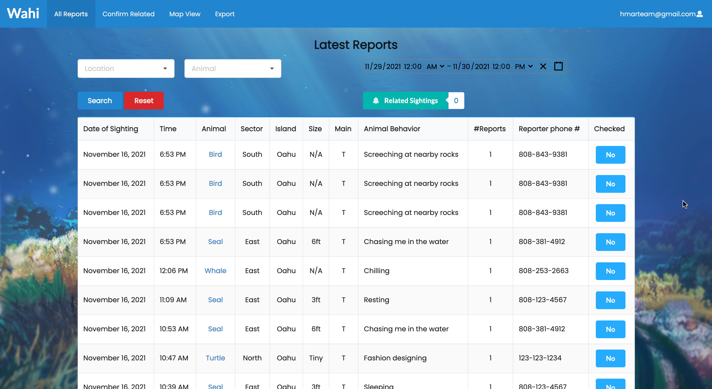
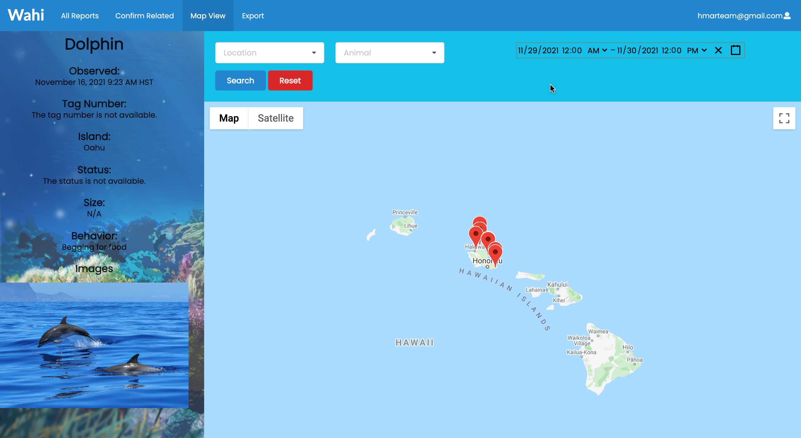

## Description of the application developed
HMAR and NIC currently have a system where public beachgoers call a hotline to report marine life sightings regarding seals, turtles, and sea birds. While this system does work, for this hackathon challenge, we were tasked to help HMAR and NIC solve some issues they currently face (e.g.  callers not knowing the location name, poor audio near the ocean, lack of photo-gathering capabilities, multiple calls per animal that isn’t consolidated into one report). Wahi is the application [Jolie](https://jolieching.github.io/), [Dylan](https://dylandecker.github.io/projects/), [Mirabela](https://miraabela.github.io/), [Abdullah](https://mujtaba-a-quadri.github.io/), and I developed from October 23rd to November 20th. Specifically, Wahi is a two-part application that includes a mobile side and web side. Essentially, public beachgoers will use the phone app we designed to fill out a form that records information and pictures about the animal and the user’s location. 

Once they submit the form, it will be added to the application’s database and will be accessible by HMAR volunteers on the Wahi website. On this website, HMAR volunteers have several views. 

This view displays all of the reports (which can be filtered) and allows for volunteers to confirm whether a report is legitimate.

This view displays sightings that the algorithm we wrote found were related. Here, volunteers can confirm or deny whether these reports are indeed related. 

This view allows the volunteers to view the reports on a map.

This view has buttons that the volunteers can press in order to download a csv file with all of the reports (per animal) that is formatted in a way that is compatible with the spreadsheet HMAR and NIC currently use. 

## Links to the source code (and deployed application)
 - [Source code](https://github.com/HACC2021/DAAJ)
 - [Deployment](https://daaj.meteorapp.com/)
 - [Devpost](https://devpost.com/software/daaj)

## What I learned from the experience
From the get-go, the biggest problem we had was making sure everyone could run the meteor + react-native application on their machine. It was actually quite interesting to learn how to connect the two! However, almost everyone on our team had never worked on making a mobile app so we had to go through a few hurdles (someone’s PATH variable may or may not have been broken; dependency issues) before we could actually start developing. Thankfully, we worked on this as soon as the HACC began so in that regard, I can definitely acknowledge the strength in starting early. The biggest things that threw me off with this tech stack were how meteor collections were designed and how collections were received on each page.

There were three lessons I learned from the prior Meteor hackathon that I applied to this hackathon: make seed data early on, add better comments to functions for my and my teammates' sake, and pseudocode when possible. Although making seed data was very tedious because there are many fields to fill out per animal, I gained some valuable insights. Besides the fact that seed data made it easier for people to test their features, I also found it to be a morale booster; for each report, I had to describe what the animal was doing at the time of sighting and let’s just say I took some liberty to make them humorous. Every time I saw these descriptions as I was developing, I always cracked up. 

For this hackathon, I made sure to make more detailed and formal function descriptions. This came in especially handy when Jolie and I were working on the filtering capabilities and I could easily help us stay on the same page by showing her the description of the function I was writing that she would be using. Lastly, for this competition, I pseudocoded the functions needed for the related reports to work first because I found that pseudocoding during the Meteor Hackathon to be particularly successful for me. Speaking of the related-reports algorithm, I definitely don’t know if I did it in the best way so I look forward to checking out how other groups did this part and pick up on some knowledge!

Additionally, I found out that semantic ui actually has an automatic table filtering feature after seeing another group do this! I’m definitely going to look into that in the future, because this team’s table looked so crisp. Another thing I learned was that you should think in advance about when you want to have the data in the database to be coded. For example, in HMAR’s original spreadsheet (i.e. their current system), they indicated the color of a tag with code R and N (red and other). To make the tables less crowded and the exporting more straightforward, we kept this coding in the database. However, at the end I was concerned that people would be confused if they didn't know the code (even though volunteers should know the code as it’s the code used in their spreadsheet), so I definitely think this is an issue people should consider in advance. 

## What I personally contributed to the project
We had a bit of a difficult time choosing which challenge to do, but once we decided on the marine-sighting challenge, I practiced my requirements gathering skill. I read everything that was posted about this challenge and made sure to ask questions during their sessions. For example, we asked whether they wanted the ability to create multiple accounts or did they just want one account for their entire organization. Once we found out that they wanted one, we focused less on accounts. Next, I worked with Mirabela to get the Meteor and React-native stack to work. As a team, we were initially considering the possibility of using Cordova, but we decided that a mobile app could be beneficial to the public because of its more integrated interface. I also worked on the mockups of the web application and here’s also a mockup of the mobile app that I designed but unfortunately we ran out of time to implement it. 

For this challenge, I also designed the collections and found it to be a pretty daunting task, namely because each animal had a lot of fields and many of them were unique to each animal. There were a good bunch of fields that were common to all animals but some had different column names per animal so that took some time to parse too. Additionally, I had to make sure to have common fields have the same name between collections so that when we used a spread to merge all 4 collections, they would line up correctly. After I finished the collections, I then worked on seeding (as mentioned above). During the seeding process, I also designed a handy dandy function that returns a Date object that is minutes or hours of your choice before or after the time the function is called. 

Besides working on the related-sightings algorithm and filters, I also worked on making the reports editable/deletable and worked on the export feature with Dylan. Thankfully, Dylan knew how to do the exporting part already so that was less stressful. However we did run into some issues where certain characters in the column names (e.g. ‘#’) couldn’t be encoded, so that’s a bug we still need to squash. I found that making the reports editable was actually pretty difficult, because when making the Meteor collections work with React-native, I couldn’t figure out how to make the collection have a built-in schema for validation, so now I was faced with making a form with no existing schema. In the end, I had to make a schema just for validating the form, which works but next time I will spend time on making a built-in schema for each collection. 

For this hackathon, I also took on a more project-management role which was fun because I got to check-in on people and I finally became comfortable with utilizing the Github project boards. Finally, the last thing I did was find a background for our application. It’s such an easy coding change (aka just adding a small css block), but it took me quite a while to find the perfect background for our application. I’m super happy with how it looks though so behold!

## Final thoughts
	This semester went by so quickly once the hackathons started and it’s crazy to think about how our group went from barely knowing each other to a fun and understanding team. I was initially really scared to take this class because I haven’t taken ICS 314 yet, but I’m glad I did because I learned a lot this semester, especially about the importance of teamwork and communication.
