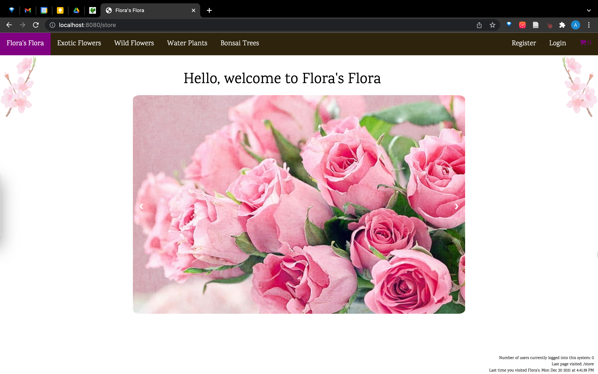
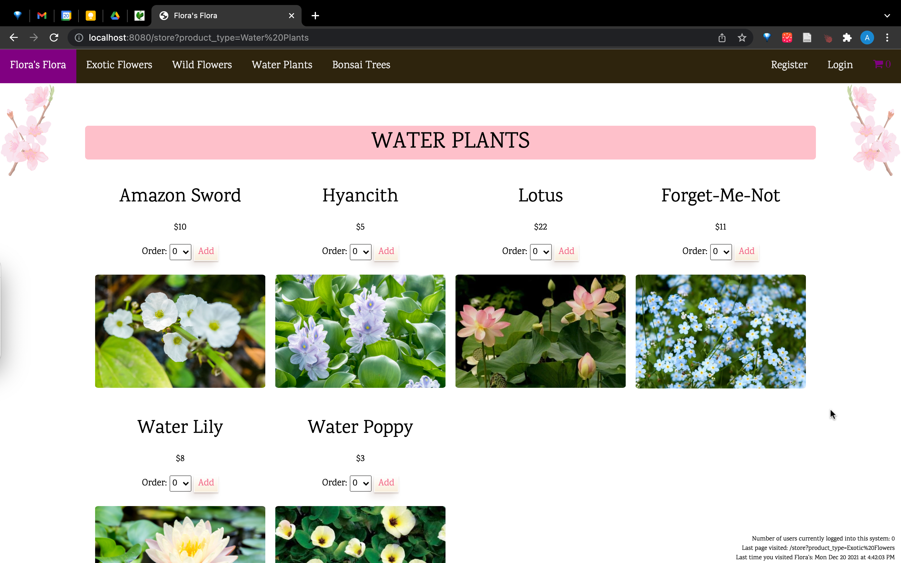
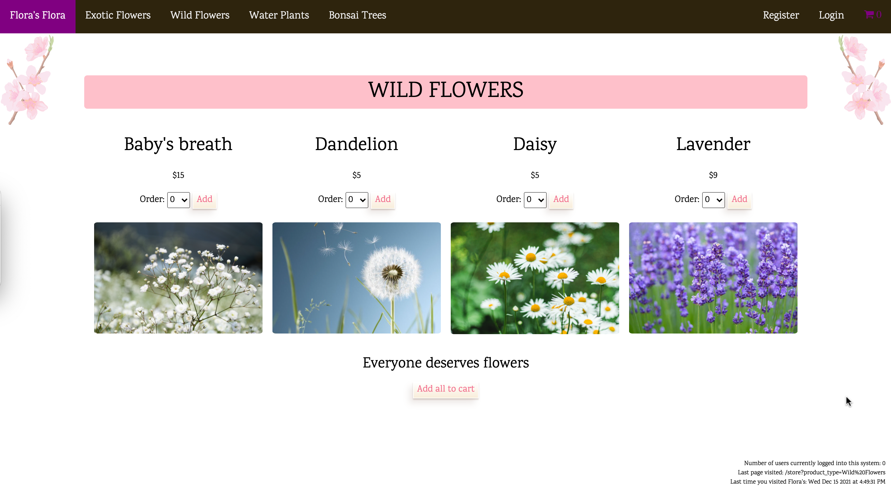
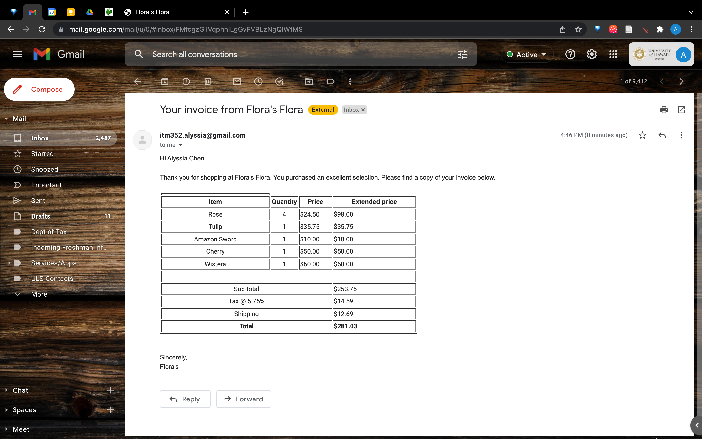
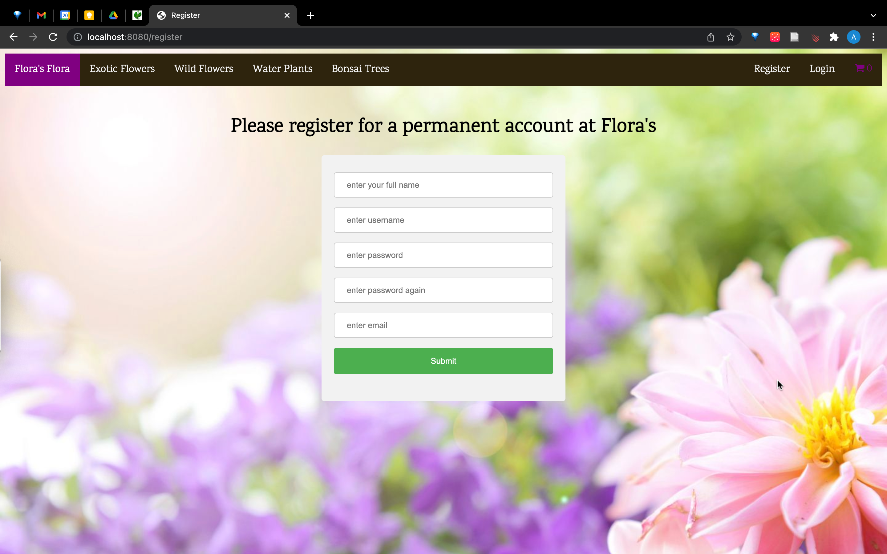

## Description of the application developed
Using what we learned during the course of this class (ITM 352), we had to build a pretend e-commerce website. The website had to meet a set of requirements, including a cart that users can edit, an email with the invoice that is sent to the user, and the use of sessions/cookies to maintain personalization.

## Links
 - [Source code](https://github.com/alyssia-chen/ITM352_F21_repo/tree/main/Chen_Alyssia_Assignment3) (Currently private but can be shown upon request)
 - [Brief Video Overview](https://drive.google.com/file/d/1gD3T8P_z3mdMaAVRqeU4ofFGNEvyoIu9/view?usp=sharing)

## Pictures

## What I learned from the experience
I really enjoyed learning about routing the server requests and it was through this process that I finally understood the difference between GETs and POSTs. My prior experience with building websites all used Meteor so there was definitely a layer of abstraction that I'm beginning to unveil now. Additionally, I learned how sessions and cookies work and how to use them. In the future, I hope to learn how to use them as efficiently as possible. Because of past experience with using meteor and semantic ui, I took the good practices that I picked up on to apply to this project such as creating ui components that can be reused throughout the application. 
